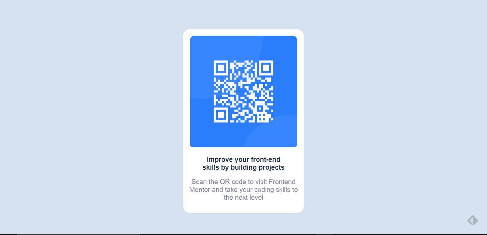

# Frontend Mentor - QR code component solution

This is a solution to the [QR code component challenge on Frontend Mentor](https://www.frontendmentor.io/challenges/qr-code-component-iux_sIO_H). Frontend Mentor challenges help you improve your coding skills by building realistic projects. 

## Table of contents

- [Overview](#overview)
  - [Screenshot](#screenshot)
  - [Links](#links)
- [My process](#my-process)
  - [Built with](#built-with)
  - [What I learned](#what-i-learned)
  - [Continued development](#continued-development)
  - [Useful resources](#useful-resources)
- [Author](#author)

## Overview

### Screenshot



### Links

- Solution URL: [Add solution URL here](https://your-solution-url.com)
- Live Site URL: [Add live site URL here](https://your-live-site-url.com)

## My process
 I started off with the HTML, wrote few lines of codes which were placed in a DIV tag then went on to the css...I styled the background color and text with the style color I downloaded in the zip file. Then after used padding and margin, positioned the DIV to the center using margin: auto which works with display: block <tag>.

### Built with

- Semantic HTML5 markup
- CSS custom properties

### What I learned

I learnt it's easier to master HTML/CSS if one does a challenge like this to test one's skill. Finally
 have been able to test my skills and I completed this challenge within 30 minutes that's a good start for me!

To see how you can add code snippets, see below:

```html
<h1>Some HTML code I'm proud of DIV tag and IMG tag</h1>

```css
.l34kc0d3 {
  color: anuoluwapo;
}

### Continued development

I want to focus on CSS Animation/Transition and also CSS GRID in future projects.

### Useful resources

- (https://www.jafricode.com) - This helped me on the fundamentals of HTML and CSS. I loved the way he taught and will use it going forward. Mostly got his course on Udemy.com
- (https://w3schools.com) - This is an amazing article which helped me understand more basics on CSS FLEXBOX. I'd recommend it to anyone still learning this concept.

## Author

- GItHub - [Anuoluwapo Ademola](https://www.github.com/Anuoluwapo1469)
- Frontend Mentor - [@yourusername](https://www.frontendmentor.io/profile/yourusername)
- Twitter - [@l34kc0d3](https://www.twitter.com/l34kc0d3)

